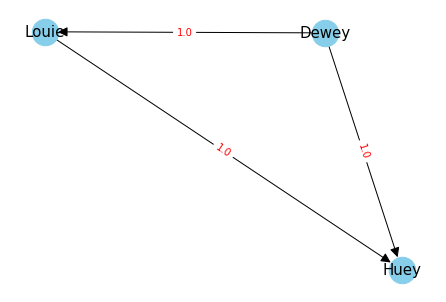

# Condorcet Method - Voting system

This is a user-friendly voting system to determine a winner in a multi-candidate election. The Condorcet method compare each candidate in pairwise matchups (based on the number of times each candidate is preferred over another to avoid Condorcet paradox).

## Installation

Carry out these steps (make sure you have already installed Python) :

```bash
# --- Clone the repository
git clone https://github.com/DataSaiyentist/Condorcet_method.git
cd Condorcet_method

# --- Install the required packages
pip install -r requirements.txt
```

## Getting started

Run the script using the command :

```bash
python script.py
```
Follow then the on-screen instructions to provide the number of candidates, their names, the number of voters, and their preferences.
Once you are done, the Condorcet method will be applied, and the results (including the winner) will be displayed.

Let's for instance consider this scenario :

```python
3        # Number of candidates
Huey     # Name of candidate 1
Dewey    # Name of candidate 2
Louie    # Name of candidate 3
3        # Number of voters
1 2 3    # Voter 1's choices
2 3 1    # Voter 2's choices
3 2 1    # Voter 3's choices
```

The Condorcet method will assess Dewey as the winner. And this result will go along with this directed graph :



The graphical representation underscores the following preferences:

* Dewey is the preferred choice over Louie
* Dewey is the preferred choice over Huey
* Louie is the preferred choice over Huey

Besides, if you take the path that passes through all the nodes, optimizing for the most favorable weights, you will end up with a ranking according to the Concordet method. In this case, it would be : `Dewey > Louie > Huey`.

It is recommended to be cautious when applying this method in situations with limited voters, and you may consider alternative approches or interpret the (inconsistent or counterintuitive) results with an awarness of the potential limitations associated with the Condorcet paradox.

## License

Copyright © 2023 [Data Saiyentist](https://github.com/DataSaiyentist). <br />
This project is [MIT License](https://github.com/DataSaiyentist/Condorcet_method/blob/main/LICENSE) licensed.